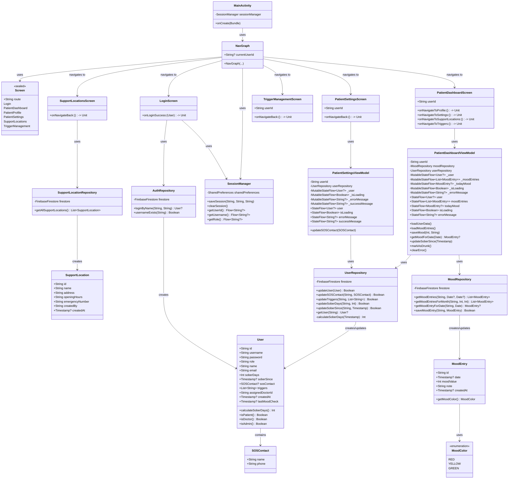
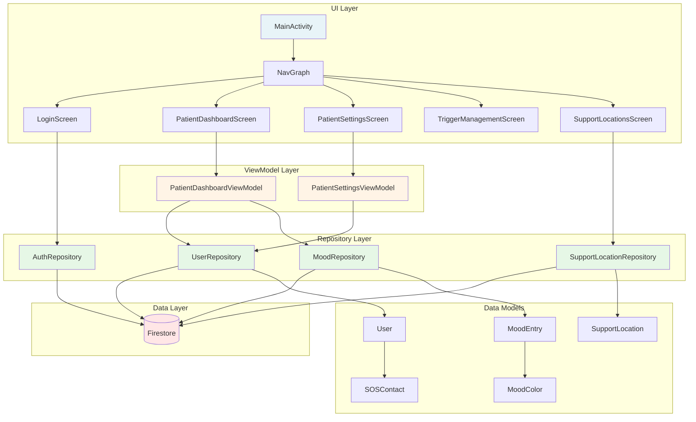

# SoberUp App - UML Klassendiagramm (Mermaid)

## Vollständiges Klassendiagramm

## Vereinfachtes Architektur-Diagramm

## Komponenten-Übersicht

### UI Layer (Blau)
- **MainActivity**: Haupteinstiegspunkt
- **NavGraph**: Navigation zwischen Screens
- **Screens**: Alle UI-Komponenten

### ViewModel Layer (Gelb)
- **PatientDashboardViewModel**: Logik für Dashboard
- **PatientSettingsViewModel**: Logik für Einstellungen

### Repository Layer (Grün)
- **UserRepository**: Benutzerdaten
- **MoodRepository**: Stimmungseinträge
- **AuthRepository**: Authentifizierung
- **SupportLocationRepository**: Anlaufstellen

### Data Layer (Rot)
- **Firestore**: Cloud-Datenbank

### Data Models
- **User**: Hauptbenutzermodell
- **MoodEntry**: Stimmungseintrag
- **SupportLocation**: Anlaufstelle
- **SOSContact**: Notfallkontakt
- **MoodColor**: Stimmungsfarben-Enum

